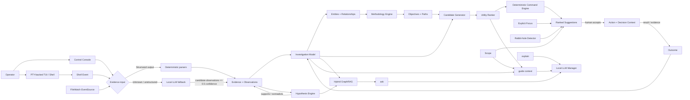
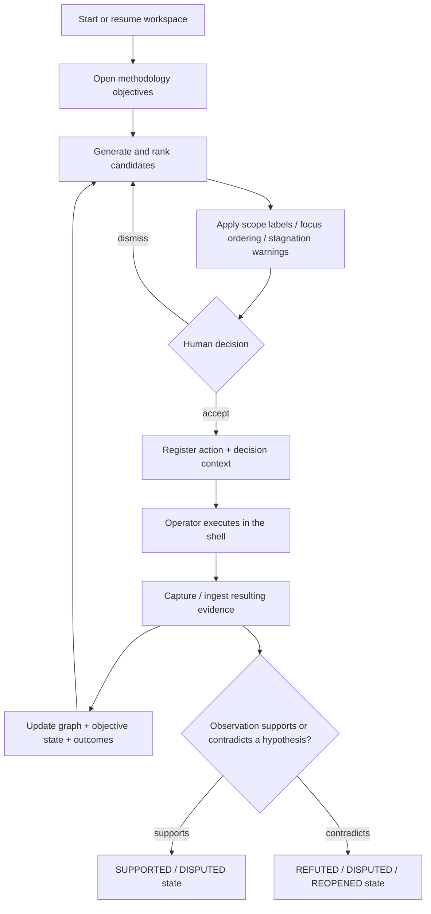
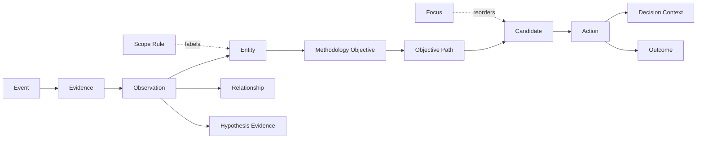

<div align="center">

# EXITONE

**Stateful investigation guidance for security research from the terminal.**

`observe · correlate · suggest — the human decides and executes`


</div>

> [!IMPORTANT]
> ExitOne is intentionally **human-in-the-loop**. It can correlate evidence, rank and render command suggestions, explain methodology, and warn about stale investigative paths, but it does not autonomously execute commands against a target. Use it only in environments you own or are explicitly authorized to test.

ExitOne is a terminal-native investigation engine for pentesting, labs, and CTF-style security research. Instead of treating every command as an isolated interaction, it maintains a persistent investigation model: what is known, what remains unknown, what has already been tried, what evidence produced each fact, and which investigative paths are currently worth attention.

The core design is **deterministic before generative**. Go and SQL own facts, graph traversal, methodology, scope state, coverage, ranking, focus, and rabbit-hole detection. A local LLM is used only where language generation adds value: low-trust fallback extraction, grounded questions, methodology mentoring, and narration of an already-computed next step.

---

## Why ExitOne

Traditional shell workflows lose context between tools. Generic AI assistants have the opposite problem: they can reason conversationally, but often lack a reliable and auditable model of what actually happened in the terminal.

ExitOne sits between those two approaches:

- **Persistent investigation state** — events, evidence, observations, entities, relationships, objectives, candidates, actions, outcomes, hypotheses, focus, and scope are persisted in SQLite.
- **Closed provenance chain** — shell metadata can flow through `Event → Evidence → Observation → Entity/Relationship` rather than being discarded after parsing.
- **Cross-tool correlation** — methodology triggers operate on entity types and relationships rather than a hard-coded tool workflow.
- **Explainable strategy** — candidates are ranked with explicit utility factors and can be inspected with `why`.
- **Contextual Control Console** — navigate hosts, services, objectives, hypotheses, candidates, coverage, evidence, focus, and workspaces without losing state between commands.
- **Explicit operator focus** — `focus` reorders related suggestions first but never hides the rest of the investigation.
- **Rabbit-hole detection** — repeated attempts that produce no new evidence can be flagged when an untried alternative branch exists.
- **Scope awareness** — in-scope, explicitly excluded, and unknown assets remain visible throughout the console and mentor flow.
- **Provenance-aware ingestion** — deterministic observations and LLM-assisted observations remain visibly distinct.
- **Hybrid GraphRAG** — `ask` uses narrow LLM classification plus deterministic SQL traversal before natural-language rendering.
- **Self-managed local LLM** — ExitOne can start and health-check its own `llama-server` instead of requiring a manually managed sidecar.
- **Human execution boundary** — suggestions can be inserted into a shell buffer, but execution remains an explicit operator action.

---

## Architecture



### Investigation lifecycle



---

## Terminal experience

ExitOne now has two complementary interactive surfaces plus the direct CLI.

### 1. Control Console — investigation navigation

Running `exitone` or `exitone repl` opens the **Control Console**. It keeps a persistent context stack in-process, so navigation survives between commands instead of re-launching the binary for every line.

```text
┌────────────────────────────────────────────────────────────┐
│                      E X I T O N E                         │
│          exit code 1 — algo requiere investigación        │
└────────────────────────────────────────────────────────────┘
  observa · correlaciona · sugiere — el humano decide y ejecuta

[+] workspace activo: 10.10.10.10

exitone(10.10.10.10) > show hosts
exitone(10.10.10.10) > use 0
exitone host(10.10.10.10) > show services
exitone host(10.10.10.10) > use 1
exitone service(ssh) > info
```

The console is driven by a single command registry used for dispatch, help, aliases, and completion. Core navigation includes:

| Command | Purpose |
| --- | --- |
| `show <...>` | List objects, filtered by the current context unless `--all` is used |
| `use <index|id|token>` | Enter a host, service, objective, hypothesis, or candidate context |
| `back` | Return to the previous context |
| `info` | Inspect the currently loaded object |
| `search [filters] <text>` | Search across investigation objects |
| `workspace <new|use|list|info>` | Manage investigation workspaces |
| `help [command] [--all]` | Contextual command help |

`show` currently exposes:

```text
hosts · services · objectives · hypotheses · candidates · coverage · focus · evidence
```

Direct aliases also exist for `hosts`, `services`, `hypotheses`, and `coverage`.

The console stores history in:

```text
~/.exitone/history
```

Known sensitive flags such as `--password`, `--pass`, `--token`, `--secret`, and `--api-key` are filtered before history is written to disk.

> [!NOTE]
> Navigation context and investigative **focus** are intentionally separate concepts. `use` changes what you are viewing. `focus` changes what ExitOne should prioritize visually in `next`.

### 2. TUI — live shell workflow

`exitone start <target>` opens a single application with a real PTY-backed shell on the left and a live investigation sidebar on the right.

```text
┌──────────────────────────────── terminal ────────────────────────────────┬──────── ExitOne ────────┐
│ kali@lab:~$ nmap ...                                                     │ target: 10.10.10.10     │
│                                                                          │ [OVERVIEW]              │
│                                                                          │ ETAPAS                  │
│                                                                          │ surface_discovery ...   │
│                                                                          │                         │
│                                                                          │ SUGERENCIAS             │
│                                                                          │ 0.90 [...] nmap ...     │
│                                                                          │                         │
│                                                                          │ OBJECTIVES ABIERTOS     │
└──────────────────────────────────────────────────────────────────────────┴─────────────────────────┘
  Ctrl+Space: suggestion · F2: view · Ctrl+P: pause · F1: help · Ctrl+Q: exit
```

The sidebar has three views:

| View | Purpose |
| --- | --- |
| **OVERVIEW** | Investigation stages, highest-ranked suggestions, and open objectives |
| **GRAPH** | ASCII attack-surface view built from stored entity relationships |
| **VAULT** | Discovered identities with provenance (`confirmed`, source-provided, or LLM-assisted) |

Keyboard shortcuts:

| Key | Action |
| --- | --- |
| <kbd>Ctrl</kbd>+<kbd>Space</kbd> | Insert the top-ranked command into the prompt — **never executes it** |
| <kbd>F2</kbd> | Cycle `OVERVIEW → GRAPH → VAULT` |
| <kbd>Ctrl</kbd>+<kbd>P</kbd> | Pause/resume sidebar refresh |
| <kbd>F1</kbd> | Contextual help |
| <kbd>Ctrl</kbd>+<kbd>Q</kbd> | Exit the TUI |

The embedded TUI now mirrors raw PTY bytes into its own stream file under `~/.exitone/streams/`. When the Zsh hooks are loaded, they use this stream to delimit each completed command and submit its output to the existing ingestion pipeline. tmux `pipe-pane` remains a fallback rather than the primary capture mechanism.

### 3. Read-only dashboard

`exitone watch` continuously renders stages, top candidates, and open objectives. `exitone start <target> --tmux` keeps the older two-pane tmux layout for operators who prefer a normal shell pane next to the dashboard.

---

## Requirements

### Required

- **Go 1.27+**
- A Unix-like terminal environment suitable for PTY-based applications

### Recommended

- **Zsh** for automatic command-boundary tracking, event metadata, output capture, auto-ingestion, and the `Ctrl+Space` ZLE widget

### Optional

- **tmux** for the legacy `--tmux` layout and fallback `pipe-pane` capture
- **llama-server + a GGUF model** for local AI features
- Or an externally managed **OpenAI-compatible** endpoint via `EXITONE_LLM_URL`

ExitOne does not require a hosted AI provider.

---

## Installation

```bash
git clone https://github.com/neavus-23/exitone.git
cd exitone

go build -o exitone ./cmd/exitone
mkdir -p "$HOME/.local/bin"
install -m 0755 exitone "$HOME/.local/bin/exitone"
```

Make sure `~/.local/bin` is in your `PATH`.

Launch the Control Console:

```bash
exitone
```

Or start directly in the live TUI:

```bash
exitone start 10.10.10.10
```

Sessions for the same target are resumed by default. A clean session can still be created explicitly through the legacy CLI:

```bash
exitone session new 10.10.10.10 --fresh
```

Inside the Control Console, use workspaces instead:

```text
workspace new 10.10.10.10
workspace list
workspace use <id-or-target>
workspace info
```

---

## Optional: Zsh integration

The repository includes shell hooks for command events, explicit output-file ingestion, PTY/tmux stream slicing, background ingestion, and a `Ctrl+Space` suggestion widget.

```bash
mkdir -p "$HOME/.exitone"
cp contrib/exitone-hooks.zsh "$HOME/.exitone/exitone-hooks.zsh"
cp contrib/exitone-widget.zsh "$HOME/.exitone/exitone-widget.zsh"

echo 'source "$HOME/.exitone/exitone-hooks.zsh"' >> "$HOME/.zshrc"
source "$HOME/.zshrc"
```

> [!WARNING]
> `contrib/exitone-hooks.zsh` currently assigns its own `PROMPT`. If you use Starship, Powerlevel10k, Oh My Zsh themes, or another custom prompt, remove or adapt that `PROMPT=...` line before sourcing the hook.

### Capture behavior

| Mode | Behavior |
| --- | --- |
| Command writes an output file (`-o`, `-oG`, `-oX`, `--output`, `>`, etc.) | The hook passes the file to `exitone ingest` and attaches shell event metadata |
| Embedded TUI + hooks, no output file | The TUI mirrors PTY bytes to `EXITONE_STREAM_FILE`; hooks slice the command output and ingest it in the background |
| tmux + hooks, no output file | `tmux pipe-pane` supplies the same stream format as a fallback |
| No hooks | CLI/TUI still work, but automatic command-boundary/event association and background output ingestion are not provided |

Shell event metadata includes command, working directory, timestamps, exit code, and pane information when available. That event can then be linked to the evidence generated from the command.

---

## Quick start

### 1. Start an investigation

```bash
exitone start 10.10.10.10
```

ExitOne creates/resumes the workspace, ensures the target host exists in the investigation model, opens the initial discovery objective, and can generate an initial candidate.

### 2. Review the next candidates

```bash
exitone next
```

Example deterministic candidate:

```bash
nmap -sV -sC -p- 10.10.10.10 -oG nmap_full_10_10_10_10.txt
```

Understand why it was ranked:

```bash
exitone why <candidate-id-prefix>
```

### 3. Accept a candidate

```bash
exitone accept <candidate-id-prefix>
```

`accept` registers the action and its decision context. It **does not execute the command**.

Execute it yourself when appropriate. With the TUI + Zsh hooks, stdout can be captured and ingested without requiring an explicit output file. Manual ingestion remains available:

```bash
exitone ingest ./result.txt
```

To explicitly bind evidence to an accepted action:

```bash
exitone ingest ./result.txt --for-action <action-id-prefix>
```

### 4. Navigate the investigation

Inside the Control Console:

```text
show hosts
use 0
show services
show evidence
show candidates
show coverage
info
back
```

### 5. Set an explicit focus

```bash
exitone focus <hypothesis-or-objective-id-prefix>
exitone focus
exitone focus clear
```

Focus is operator intent, not an inferred stage. It places related candidates first but never hides unrelated ones.

### 6. Ask, guide, or explain

```text
ask "¿qué falta por investigar?"
guide
explain OpenSSH
```

These commands have different trust boundaries:

- `ask` answers questions grounded in stored investigation state through Hybrid GraphRAG.
- `guide` narrates the **already-computed** top candidate in the context of real investigation stages and scope.
- `explain` receives only a technology/protocol/concept and gives generic methodology context; it does not receive target state and therefore cannot legitimately claim a target-specific vulnerability.

---

## Control Console command map

| Category | Commands |
| --- | --- |
| Core | `help`, `clear`, `exit` |
| Navigation | `show`, `use`, `back`, `info`, `search`, `hosts`, `services`, `hypotheses`, `coverage` |
| Workspace | `workspace`, legacy alias `session` |
| Strategy | `next`, `why`, `accept`, `resolve`, `dismiss`, `focus` |
| Mentor | `guide`, `explain` |
| Scope | `scope` |
| Evidence | `ingest`, `ask`, `status`, `stages` |
| Terminal | `watch`, `start`, `tui` |

Selected syntax:

```text
show <hosts|services|objectives|hypotheses|candidates|coverage|focus|evidence> [--all]
search [type:<t>] [status:<s>] [host:<ip>] <text>
workspace <new|use|list|info> ...
next [--raw]
why <candidate-id-prefix | hypothesis-id-prefix>
accept <candidate-id-prefix>
resolve <action-id-prefix> --result <fail|success>
focus [<hypothesis-or-objective-id-prefix>|clear]
scope <add|list|remove> <pattern> [--out] [--note "..."]
explain [technology|service]
guide
ingest <file> [--tool <hint>] [--host <ip>] [--for-action <id>]
ingest watch <directory>
ask "<question>"
```

---

## Scope tracking

Scope is explicit operator input for bug-bounty programs and rules of engagement.

```text
scope add example.com
scope add internal.example.com --out --note "explicitly excluded"
scope list
scope remove <id-or-exact-pattern>
```

Scope classification is surfaced in hosts, services, candidates, contextual `next`, and `guide`.

Rules produce three states:

```text
in · out · unknown
```

An explicit exclusion wins when both an inclusion and exclusion match.

> [!WARNING]
> Scope is currently **advisory, not an enforcement gate**. It marks excluded assets prominently but does not block the operator from running a command.

> [!NOTE]
> Current matching is case-insensitive text matching (exact/substring relationship), not real CIDR arithmetic. A pattern such as `10.0.0.0/8` is not expanded into a network range.

---

## Focus and rabbit-hole detection

### Explicit focus

`focus` records where the operator intentionally wants to invest effort. Current focus targets are:

```text
hypothesis · objective
```

`next` performs a stable partition: candidates related to the focus are shown first, preserving normal score order inside each group. Nothing is silently hidden.

### Rabbit-hole warning

ExitOne can warn when a branch appears stagnant. The current MVP signal is deterministic and requires all of the following:

- at least **3** resolved attempts on the same objective path and intent,
- the path is still open,
- those attempts produced no new entities or relationships,
- and an alternative open path has an untried proposed candidate.

If the operator has explicitly focused the stagnant objective, ExitOne retains the recommendation but still reports the stagnation. Human control does not suppress warnings.

---

## Evidence ingestion

ExitOne uses a two-level extraction model plus multiple artifact sources.

### Level 1 — deterministic

Deterministic parsing is preferred whenever the shape can be recognized reliably.

| Input | Current handling | Confidence |
| --- | --- | ---: |
| Nmap greppable output | Native deterministic parser | `1.0` |
| `smbclient -L` listings | Native deterministic parser | `1.0` |
| XML with recognizable host/service field aliases | Generic shape-based parser | `1.0` |
| JSON with recognizable host/service/endpoint aliases | Generic shape-based parser | `1.0` |
| Common text tables with host/port/state fields | Generic table parser | `1.0` |
| Web-enumeration lines containing URL + HTTP status | Generic endpoint parser | `1.0` |
| Identity list, one entry per line | Deterministic manual-ingest path | `1.0` |

The generic parsers recognize data by **shape and field aliases**, not by a tool allowlist. Examples include:

- host: `address`, `addr`, `ip`
- port: `port`, `portid`
- protocol: `proto`, `protocol`
- service: `name`, `service`, `servicename`
- state: `state`, `status`
- version/banner: `product`, `version`, `extrainfo`, `banner`
- endpoint: `url`, `input`, `path`
- HTTP status: `status`, `statuscode`, `code`
- response size: `length`, `size`

This lets structurally similar outputs from different scanners feed the same normalized investigation model.

### Level 2 — local LLM fallback

If no deterministic extractor can handle the output, ExitOne can send a bounded slice to the local LLM and request explicit candidate observations.

Trust rules are enforced in code:

- LLM observations are stored with `status='candidate'`.
- Confidence is hard-capped at **0.5**, regardless of what the model returns.
- LLM-derived entities are marked `attrs.extracted_by="llm"`.
- Level 2 entities do **not currently trigger methodology or candidate generation automatically**.

The fallback therefore enriches visibility without silently promoting model inference to confirmed evidence.

### Artifact sources

Manual ingestion remains the base primitive:

```bash
exitone ingest ./artifact.json
```

A simple directory watcher is also available:

```bash
exitone ingest watch ./exports
```

It watches for files created after startup and submits each new artifact through the existing ingestion pipeline.

> [!NOTE]
> `FileWatchEventSource` is an extension point, not proof of native integrations. ExitOne does **not** currently implement dedicated Burp, browser, BloodHound, or Metasploit event sources.

---

## Provenance model

ExitOne persists a relational investigation graph in SQLite rather than keeping context only in prompts.



Important properties:

- Entities are unique by `(session, type, canonical value)`.
- Re-ingesting the same structured evidence is designed to be idempotent.
- Existing attributes are merged without overwriting useful values with empty data.
- Deterministic relationships can retain the observation that supports them.
- Shell-hook ingestion can retain the event that produced the raw evidence.
- Accepted actions preserve a snapshot of what was known when the decision was made.
- Hypotheses link to **observations**, not entire evidence blobs.

The database lives at:

```text
~/.exitone/exitone.db
```

SQLite runs with WAL and foreign-key enforcement enabled.

---

## Methodology model

Current methodology triggers are based on discovered entity types and service semantics:

| Trigger | Objective | Paths currently modeled |
| --- | --- | --- |
| Any target host | `initial_discovery` | Port/service discovery |
| SMB-like service | `smb_enumeration` | Anonymous access, authenticated access, alternative source |
| SSH service | `ssh_auth_investigation` | Test known identities |
| HTTP/HTTPS service | `http_enumeration` | Technology, application structure, endpoints, auth surface, identities |
| Domain entity | `domain_identity_enumeration` | Anonymous LDAP, Kerberos user enumeration, authenticated query |

> [!NOTE]
> An objective being modeled does **not** mean every path already has a deterministic command template. ExitOne deliberately keeps unsupported paths visible as known unknowns instead of fabricating a command.

Current deterministic command-generation paths include:

- initial Nmap service discovery,
- anonymous SMB share enumeration,
- SSH authentication checks for known identities,
- read-only `curl -s -i` follow-up for selected interesting endpoints.

---

## Explainable utility ranking

Candidates are ranked from explicit factors rather than an opaque LLM score.

```text
utility_score = novelty
              × relevance
              × source_confidence
              × max(hypothesis_impact, 0.05)
              × max(objective_impact, 0.05)
              × uncertainty_reduction
              - redundancy_penalty
```

Inspect the actual terms for any candidate:

```bash
exitone why <candidate-id-prefix>
```

The implementation deliberately calls this a **utility heuristic**, not statistical Expected Information Gain: there is no probabilistic model behind the score.

Existing database column names retain older terminology for compatibility, but the strategy semantics are heuristic and auditable.

---

## Hypothesis engine

Hypotheses now represent explicit falsifiable propositions rather than a proxy for “coverage still exists.”

Current categorical states are:

```text
UNTESTED · SUPPORTED · DISPUTED · REFUTED · CONFIRMED · REOPENED
```

Evidence is linked at the **Observation** level through one of two relations:

```text
supports · contradicts
```

This gives a traceable path:

```text
Hypothesis → Observation → Evidence → Event
```

Behavior is categorical, not a fake confidence score derived from counting observations:

- support without contradiction → `SUPPORTED`,
- support plus contradiction → `DISPUTED`,
- contradiction can move the hypothesis to `REFUTED`,
- explicit confirmation is supported by the engine,
- a later contradiction against a previously `CONFIRMED`/`REFUTED` hypothesis can mark it `REOPENED`.

`why` can inspect either a candidate or a hypothesis:

```bash
exitone why <candidate-id-prefix>
exitone why <hypothesis-id-prefix>
```

> [!IMPORTANT]
> A newly discovered identity no longer reopens an SSH hypothesis merely because the set of known identities changed. New identities are treated as **coverage still to test**, and the candidate generator can create the missing `(service, identity)` test directly. Reopening is reserved for contradictory evidence about an actual proposition.

`resolve <action> --result fail|success` now records the manual action result; it no longer manufactures a new hypothesis for every SSH attempt.

---

## Investigation stages

`exitone stages` and `show coverage` report discrete, evidence-backed states rather than invented completion percentages:

```text
NOT_STARTED · ACTIVE · PARTIAL · SUFFICIENT · BLOCKED · REOPENED
```

Current stage model:

- `surface_discovery`
- `service_fingerprinting`
- `http_mapping`
- `identity_discovery`
- `authentication`
- `initial_access`

`initial_access` is intentionally reported as `NOT_STARTED` because exploitation/access acquisition is **not yet modeled** in the current methodology engine.

---

## AI features and trust boundaries

### `ask` — grounded investigation query

ExitOne does not use vector search for the current investigation state. The data is already a small explicit relational graph, so deterministic SQL traversal is more precise and easier to audit.


Current intent categories include pending work, reopening chains, tool/outcome comparison, entity details, and general investigation questions.

The LLM is instructed not to invent missing relationships and not to generate new next actions through `ask`; ranked action generation remains the responsibility of the deterministic strategy pipeline.

### `guide` — narration of an already-computed next step

`guide` receives a narrow context containing:

- deterministic investigation stages,
- the candidate already ranked highest by ExitOne,
- and an out-of-scope warning when the candidate resolves to an explicitly excluded asset.

The LLM does **not** select a different technique or invent a command. It explains why the existing top candidate makes sense given the current state.

### `explain` — generic methodology mentor

`explain` is intentionally isolated from session state. It receives only a technology, protocol, objective name, or hypothesis statement and provides generic educational context.

That separation is structural: because target evidence is not sent to `Explain()`, it cannot legitimately conclude that the current target has a specific vulnerability.

---

## Local LLM lifecycle

AI calls use an OpenAI-compatible `/chat/completions` API, but the default local runtime is now managed by ExitOne itself.

Before every LLM call, ExitOne:

1. checks whether the configured API is healthy,
2. if using the default local URL and no server is running, resolves `llama-server` and a `.gguf` model,
3. starts the server as a detached process,
4. waits for the endpoint to become healthy,
5. then performs the request.

Default owned layout:

```text
~/.exitone/llm/
├── bin/
│   └── llama-server
├── models/
│   └── *.gguf
├── server.log
└── server.pid
```

ExitOne currently **does not download** the binary or model automatically. Place them in the owned paths or use environment overrides.

| Variable | Default | Purpose |
| --- | --- | --- |
| `EXITONE_LLM_URL` | `http://127.0.0.1:8090/v1` | API base URL; setting it explicitly means the operator manages that endpoint |
| `EXITONE_LLM_MODEL` | `qwen2.5-3b` | Model identifier sent to the API |
| `EXITONE_LLM_SERVER_BIN` | `~/.exitone/llm/bin/llama-server` fallback | Explicit llama-server path |
| `EXITONE_LLM_MODEL_PATH` | first `~/.exitone/llm/models/*.gguf` | Explicit GGUF model path |
| `EXITONE_DEBUG_LOG` | `~/.exitone/ultra_debug.log` | Override structured debug log path |
| `EXITONE_EVENTS_LOG` | `~/.exitone/events.jsonl` | Zsh hook event log path |

Example with ExitOne-managed local assets:

```bash
mkdir -p ~/.exitone/llm/bin ~/.exitone/llm/models
cp /path/to/llama-server ~/.exitone/llm/bin/llama-server
cp /path/to/model.gguf ~/.exitone/llm/models/
chmod +x ~/.exitone/llm/bin/llama-server

exitone ask "¿qué falta por investigar?"
```

Example with an externally managed endpoint:

```bash
export EXITONE_LLM_URL="http://127.0.0.1:9000/v1"
export EXITONE_LLM_MODEL="my-model"
```

When `EXITONE_LLM_URL` is explicitly set, ExitOne will not attempt to start a server at that URL.

---

## Data and observability

Default local files now include:

```text
~/.exitone/
├── exitone.db                 # SQLite investigation state
├── history                    # Control Console history (sensitive lines filtered)
├── ultra_debug.log            # structured JSONL diagnostic log
├── events.jsonl               # shell-hook command events
├── background_ingest.log      # background ingestion output
├── streams/
│   ├── tui<PID>.log           # embedded-TUI PTY streams
│   └── pane<ID>.log           # tmux fallback streams
└── llm/
    ├── bin/
    ├── models/
    ├── server.log
    └── server.pid
```

TUI freezes can also be diagnosed with `SIGUSR1`; ExitOne writes a goroutine dump to:

```text
~/.exitone/tui_goroutines.log
```

> [!CAUTION]
> Investigation storage and debug logs can contain targets, commands, evidence paths, candidate explanations, and LLM request/response context. Treat `~/.exitone/` as sensitive engagement data.

---

## Testing

From the repository root:

```bash
go build ./...
go vet ./...
go test ./...
```

The current automated suite covers areas including:

- Control Console registry, context stack, result sets, search, tokenization, and sensitive-history filtering,
- scope rules and exclusion precedence,
- explicit focus state,
- hypothesis state transitions and observation links,
- FileWatch EventSource behavior,
- rabbit-hole detection,
- generic XML/JSON/text extraction,
- MAC-address false-positive prevention,
- Nmap-like rich greppable records,
- FFUF/Dirb-like endpoint extraction,
- rejection of unrelated free-form output as a structured scan,
- idempotent re-ingestion,
- host creation cascading from discovered services,
- attribute merge and provenance behavior.

The self-managed `llama-server` process lifecycle is currently validated manually rather than through mocked process/HTTP unit tests.

A manual TUI validation guide is available in [`docs/testing-guide.md`](docs/testing-guide.md), though fast-moving implementation changes may reach the code before every manual guide is refreshed.

---

## Current limitations

ExitOne is an active research prototype. Important current boundaries:

1. **No autonomous exploitation.** The operator remains the execution boundary, and `initial_access` methodology is not implemented.
2. **Deterministic command coverage is still narrow.** Several methodology paths can exist before a corresponding command template exists.
3. **LLM fallback is low-trust by design.** Level 2 observations are capped at `0.5` confidence and do not automatically drive methodology.
4. **Automatic full-output ingestion depends on the Zsh hook workflow.** The embedded TUI now provides the PTY stream directly, but hooks still define command boundaries and submit slices to ingestion.
5. **Pending-action auto-linking can be ambiguous.** If multiple unresolved actions use the same tool, automatic outcome matching selects the most recent one. Use `--for-action` to disambiguate.
6. **Identity ingestion is currently a normalized list path.** Raw outputs from every identity-enumeration tool do not yet have dedicated deterministic parsers.
7. **Scope matching is not CIDR-aware.** Rules are textual and advisory; they do not block execution.
8. **Focus is currently limited to hypotheses and objectives.** Host/service focus is not yet modeled.
9. **Self-managed LLM means lifecycle management, not automatic installation.** The operator still provides `llama-server` and a GGUF model unless using an external endpoint.
10. **EventSource integrations are intentionally minimal.** The current concrete source is directory file watching; there are no dedicated Burp/browser/BloodHound connectors yet.
11. **Shell hooks are Zsh-oriented.** Other shells can still use the Console, CLI, TUI, and manual ingestion but do not receive the provided hook automation.
12. **Sensitive history filtering is targeted, not a general secret scanner.** It filters known sensitive flags, not every possible credential format embedded in arbitrary command text.

These constraints are preferable to silently presenting unsupported behavior as reliable.

---

## Project layout

```text
exitone/
├── cmd/exitone/          # CLI, Control Console, dashboard, embedded-terminal TUI
├── contrib/              # Zsh hooks and Ctrl+Space widget
├── db/                   # readable schema reference
├── docs/                 # manual validation documentation
├── internal/
│   ├── commandengine/    # deterministic command rendering + provenance
│   ├── console/          # command registry, context stack, result sets, search/tables
│   ├── debuglog/         # structured diagnostic logging
│   ├── focus/            # explicit operator focus
│   ├── hypothesis/       # falsifiable hypothesis + observation lifecycle
│   ├── ingestsource/     # artifact source interface + directory watcher
│   ├── investigation/    # event/evidence/observation/entity/relationship model
│   ├── llm/              # local lifecycle, fallback extraction, GraphRAG, guide/explain
│   ├── methodology/      # entity-driven objectives and paths
│   ├── models/           # domain structs
│   ├── outcome/          # action outcomes
│   ├── parsers/          # deterministic and generic shape-based extraction
│   ├── scope/            # explicit engagement scope rules
│   ├── stage/            # evidence-derived investigation coverage estimator
│   ├── store/            # SQLite store + embedded schema
│   └── strategy/         # candidate generation, utility ranking, rabbit-hole detection
├── go.mod
└── go.sum
```

---

## Design principles

- **Deterministic before generative.** If Go/SQL can establish a fact, relationship, ordering, or warning reliably, the LLM should not be asked to invent it.
- **Evidence is not a conclusion.** Event, evidence, observation, entity, hypothesis, action, and outcome remain separate concepts.
- **Provenance stays attached.** When the producing command is known, it can remain linked all the way through evidence and observations.
- **Hypotheses are propositions, not coverage counters.** A new untested identity is missing coverage; contradictory evidence is what changes a proposition.
- **Navigation is not intent.** `use` changes the view; `focus` explicitly states where the operator wants to spend effort.
- **Scope remains visible.** Explicit exclusions are warnings and labels, never silently filtered away.
- **Suggestions must be explainable.** Utility factors and rationale are persisted and inspectable.
- **Stagnation should be detectable without ML.** Repeated no-gain attempts plus a real untried alternative are enough to warn about a rabbit hole.
- **Mentor features narrate, not decide.** `guide` explains a deterministic recommendation; `explain` teaches generic methodology.
- **The human remains the execution boundary.** ExitOne can prepare the command; the operator decides whether it should run.

---

<div align="center">

**ExitOne** — because an exit code is sometimes the beginning of the investigation.

</div>
