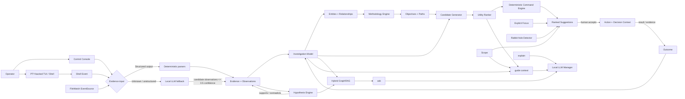
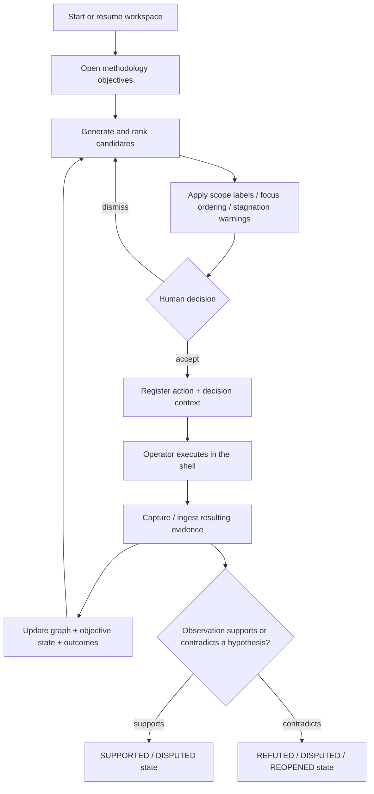
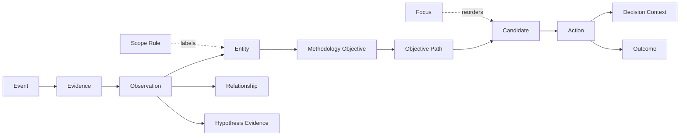
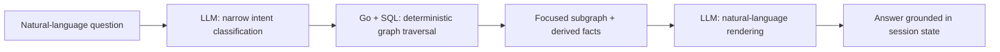

<div align="center">

# EXITONE

**Stateful investigation guidance for security research from the terminal.**

`observe · correlate · suggest — the human decides and executes`


</div>

> [!IMPORTANT]
> ExitOne is intentionally **human-in-the-loop**. It can correlate evidence, rank and render command suggestions, explain methodology, and warn about stale investigative paths, but it does not autonomously execute commands against a target. Use it only in environments you own or are explicitly authorized to test.

ExitOne is a terminal-native investigation engine for pentesting, labs, and CTF-style security research. Instead of treating every command as an isolated interaction, it maintains a persistent investigation model: what is known, what remains unknown, what has already been tried, what evidence produced each fact, and which investigative paths are currently worth attention.

The core design is **deterministic before generative**: structured outputs are parsed and correlated in Go first; a local LLM is used only where it adds value, such as low-confidence fallback extraction, asynchronous exploratory strategy, and natural-language queries over already-structured investigation state.

The full pipeline is `Telemetry → Evidence → Observations → Structured Knowledge → Investigation State → Methodology → Strategy → Candidate Actions → Human`. Exploitation guidance, post-access, and privilege/access analysis are valid parts of the investigation; autonomous execution is not.

---

## Why ExitOne

Traditional shell workflows lose context between tools. Generic AI assistants have the opposite problem: they can reason conversationally, but often lack a reliable and auditable model of what actually happened in the terminal.

ExitOne sits between those two approaches:

- **Persistent investigation state** — evidence, observations, entities, relationships, objectives, candidates, actions, outcomes, and hypotheses are stored in SQLite.
- **Cross-tool correlation** — methodology triggers operate on entity types and relationships, not on a hard-coded tool name.
- **Explainable suggestions** — candidate commands are ranked with explicit score terms and can be inspected with `exitone why`.
- **Evidence reopening** — a previously closed hypothesis can be reopened when newly discovered structured evidence invalidates the assumptions under which it was tested.
- **Provenance-aware ingestion** — deterministic observations and LLM-assisted observations are kept visibly separate.
- **Hybrid GraphRAG** — `exitone ask` uses narrow LLM classification plus deterministic SQL graph traversal before natural-language generation.
- **Human control** — candidates may be a direction, technique, or command. ExitOne never runs their stored command; pressing Enter remains the operator's decision.

---

## Pentester-first UX

ExitOne is designed so the investigation model stays mostly **behind the interface**.

The normal workflow is intentionally small:

```text
START → WORK → NOTICE → DECIDE → EXECUTE → CONTINUE
```

The terminal remains the primary workspace. ExitOne automatically captures and correlates evidence while the right-side investigation rail surfaces only:

- current state;
- the best next action;
- why it matters;
- important state changes or reopened paths.

Advanced surfaces such as Graph, Vault, Report, Replay and Config are inspection/control views, not mandatory investigation stages.

The operator should not have to manually maintain candidates, hypotheses, outcomes or report records during normal testing. Those are internal investigation objects. The expected interaction is:

```text
Ctrl+Space → insert next suggestion
Enter       → operator executes
ExitOne     → captures result and updates state
Ctrl+W      → understand why
Ctrl+A      → inspect alternatives
Ctrl+G      → ask for guidance
```

The UX goal is simple:

> **Use the terminal normally. ExitOne remembers what happened, tells you what changed, and puts the next useful option in front of you.**

See [docs/pentester-ux-audit.md](docs/pentester-ux-audit.md) for the competitive UX analysis and redesign.


---

## Architecture



### Investigation lifecycle



---

## Terminal experience

ExitOne now has two complementary interactive surfaces plus the direct CLI.

### 1. Control Console — investigation navigation

Running `exitone` or `exitone repl` opens the **Control Console**. It keeps a persistent context stack in-process, so navigation survives between commands instead of re-launching the binary for every line.

```text
┌────────────────────────────────────────────────────────────┐
│                      E X I T O N E                         │
│          exit code 1 — algo requiere investigación        │
└────────────────────────────────────────────────────────────┘
  observa · correlaciona · sugiere — el humano decide y ejecuta

[+] workspace activo: 10.10.10.10

exitone(10.10.10.10) > show hosts
exitone(10.10.10.10) > use 0
exitone host(10.10.10.10) > show services
exitone host(10.10.10.10) > use 1
exitone service(ssh) > info
```

The console is driven by a single command registry used for dispatch, help, aliases, and completion. Core navigation includes:

| Command | Purpose |
| --- | --- |
| `show <...>` | List objects, filtered by the current context unless `--all` is used |
| `use <index|id|token>` | Enter a host, service, objective, hypothesis, or candidate context |
| `back` | Return to the previous context |
| `info` | Inspect the currently loaded object |
| `search [filters] <text>` | Search across investigation objects |
| `workspace <new|use|list|info>` | Manage investigation workspaces |
| `help [command] [--all]` | Contextual command help |

`show` currently exposes:

```text
hosts · services · objectives · hypotheses · candidates · coverage · focus · evidence
```

Direct aliases also exist for `hosts`, `services`, `hypotheses`, and `coverage`.

The console stores history in:

```text
~/.exitone/history
```

Known sensitive flags such as `--password`, `--pass`, `--token`, `--secret`, and `--api-key` are filtered before history is written to disk.

> [!NOTE]
> Navigation context and investigative **focus** are intentionally separate concepts. `use` changes what you are viewing. `focus` changes what ExitOne should prioritize visually in `next`.

### 2. TUI — live shell workflow

`exitone start [target]` opens a single application with a real PTY-backed shell and a live investigation panel. The target is optional: with no workspace active, the TUI itself asks what to do before the shell starts — zero open workspaces prompts for a new target, exactly one resumes automatically with no prompt at all, and two or more show a navigable picker (`↑/↓`, `Enter`, `n` for a new one). `exitone tui` behaves the same way when invoked directly. Once a workspace is active, both panes start at 50/50, have independent vertical scrollbars, and can be resized by dragging the divider or with the keyboard.

```text
┌────────────────────── ▶ OPERATOR ──┐│┌────────────────── EXITONE ───────┐
│ kali@lab:~$ nmap ...              █│││ Overview  Graph  Vault  Chat   █│
│                                    │││ NEXT                             │
│                                    │││ 0.90  NMAP · discovery/low       │
│                                    │││ $ nmap -sV 10.10.10.10           │
│                                    │││                                  │
│                                    │││ STATE                            │
│                                    │││ ✓ Discovery · sufficient         │
│                                    │││ › Enumeration · active           │
└────────────────────────────────────┘│└──────────────────────────────────┘
  F2 vista · F3 foco · Alt+←/→ ancho · Pg↑/Pg↓ scroll · F1 ayuda
```

The investigation pane has four views, selectable with `F2` or by clicking their tabs. `OVERVIEW` is deliberately terse and assumes an experienced pentester: it puts the next command first, limits rationale to operational risk/context, and keeps secondary candidates and open paths scannable.

| View | Purpose |
| --- | --- |
| **OVERVIEW** | Investigation stages, highest-ranked suggestions, and open objectives |
| **GRAPH** | Interactive attack-surface explorer over every stored entity and active relationship |
| **VAULT** | Interactive identity/credential explorer with provenance, attempt history, masked-by-default secrets, and controlled reveal |
| **CHAT** | Session-grounded, read-only conversation with short follow-up context; chat history never becomes investigation evidence |

Keyboard shortcuts:

| Key | Action |
| --- | --- |
| <kbd>Ctrl</kbd>+<kbd>Space</kbd> | Insert the top-ranked command into the prompt — **never executes it** |
| <kbd>F2</kbd> | Cycle `OVERVIEW → GRAPH → VAULT → CHAT` |
| <kbd>F3</kbd> | Move keyboard focus between the terminal and investigation pane |
| <kbd>Alt</kbd>+<kbd>←</kbd>/<kbd>→</kbd> | Resize the panes; the center divider can also be dragged |
| <kbd>PgUp</kbd>/<kbd>PgDn</kbd> | Scroll the focused pane; mouse wheel and scrollbar dragging are also supported |
| <kbd>Ctrl</kbd>+<kbd>Home</kbd>/<kbd>End</kbd> | Jump to the beginning/end of the focused pane |
| <kbd>Ctrl</kbd>+<kbd>P</kbd> | Pause/resume sidebar refresh |
| <kbd>F1</kbd> | Contextual help |
| <kbd>Ctrl</kbd>+<kbd>Q</kbd> | Exit the TUI |

In `CHAT`, the transcript scrolls independently while the composer remains fixed. `Enter` sends, `↑/↓` recalls questions, arrow/Home/End keys edit the current line, `Ctrl+W` deletes a word, `Ctrl+U` clears the draft, `Ctrl+C` cancels an in-flight query, `Ctrl+R` retries the latest failure, and `Ctrl+L` clears the in-memory transcript. `Esc` returns keyboard control to the terminal without hiding the conversation. Duplicate questions and late responses are correlated by request ID, so a cancelled or retried answer cannot overwrite the active turn.

Only the last three successful turns are supplied as bounded dialogue context for follow-up references. This context is explicitly lower-trust than the structured session graph: it can clarify “that host” but cannot create or override evidence. Answers default to concise, conclusion-first language for an experienced pentester.

In `GRAPH`, `↑/↓` or `j/k` moves across nodes, `←/→` or `h/l` collapses and expands branches, and `Enter` toggles the selected branch. `/` opens a live filter over entity type, canonical value, attributes, and relationship kind; ancestors and one-hop context stay visible so a match is not shown without provenance. `c` clears the filter and `r` resets the view. The fixed detail footer shows the selected entity's high-signal attributes and in/out degree. Cycles and repeated relationships render as cross-links instead of recursing forever, and clicking a row selects it. Remote labels are stripped of terminal and bidirectional-control sequences before rendering to prevent scan-derived terminal injection.

In `VAULT`, identities group their linked credentials and credentials without an identity are isolated under `UNLINKED`; missing identity/service links are counted as incomplete. `↑/↓` or `j/k` navigates, `←/→` or `Enter` folds identity groups, and `/` filters by identity, service, status, source, or latest attempt — secret values are deliberately excluded from search. The fixed footer shows provenance, links, status, source, and success/failure counts. Secrets remain masked by default: press `v` twice within five seconds to reveal only the selected credential for ten seconds. Navigating, changing focus/view, opening help, or pressing `v` again hides it immediately. Control characters are rendered as escaped text rather than sent to the terminal.

The active pane is identified by both a `▶` marker and color, so focus remains visible in monochrome terminals. The embedded TUI mirrors raw PTY bytes into its own stream file under `~/.exitone/streams/`. When the Zsh hooks are loaded, they use this stream to delimit each completed command and submit its output to the existing ingestion pipeline. tmux `pipe-pane` remains a fallback rather than the primary capture mechanism.

### 3. Read-only dashboard and observable tmux layout

`exitone watch` continuously renders stages, top candidates, and open objectives. `exitone start <target> --tmux` (the target is required for this legacy layout — it doesn't go through the TUI's onboarding) creates four panes: `OPERATOR`, `EXITONE LIVE`, `EVIDENCE & EVENTS`, and `VALIDATION CONTROL`. Add `--session-name <name> --detach` to prepare a persistent session without immediately attaching; reconnect with `tmux attach -t <name>`.

---

## Requirements

### Required

- **Go 1.27+**
- A Unix-like terminal environment suitable for PTY-based applications

### Recommended

- **Zsh** for automatic command-boundary tracking, event metadata, output capture, auto-ingestion, and the `Ctrl+Space` ZLE widget

### Optional

- **tmux** for the legacy `--tmux` layout and fallback `pipe-pane` capture
- **llama-server + a GGUF model** for local AI features
- Or an externally managed **OpenAI-compatible** endpoint via `EXITONE_LLM_URL`

ExitOne does not require a hosted AI provider.

---

## Installation

```bash
git clone https://github.com/neavus-23/exitone.git
cd exitone

go build -o exitone ./cmd/exitone
mkdir -p "$HOME/.local/bin"
install -m 0755 exitone "$HOME/.local/bin/exitone"
```

Make sure `~/.local/bin` is in your `PATH`. Optionally install the man page too:

```bash
sudo install -m 0644 man/exitone.1 /usr/local/share/man/man1/exitone.1
man exitone
```

Launch the Control Console:

```bash
exitone
```

Or start directly in the live TUI:

```bash
exitone start 10.10.10.10
```

Sessions for the same target are resumed by default. A clean session can still be created explicitly through the legacy CLI:

```bash
exitone session new 10.10.10.10 --fresh
```

Inside the Control Console, use workspaces instead:

```text
workspace new 10.10.10.10
workspace list
workspace use <id-or-target>
workspace info
```

---

## Optional: Zsh integration

The repository includes shell hooks for command events, explicit output-file ingestion, PTY/tmux stream slicing, background ingestion, and a `Ctrl+Space` suggestion widget.

```bash
mkdir -p "$HOME/.exitone"
cp contrib/exitone-hooks.zsh "$HOME/.exitone/exitone-hooks.zsh"
cp contrib/exitone-widget.zsh "$HOME/.exitone/exitone-widget.zsh"

echo 'source "$HOME/.exitone/exitone-hooks.zsh"' >> "$HOME/.zshrc"
source "$HOME/.zshrc"
```

> [!WARNING]
> `contrib/exitone-hooks.zsh` currently assigns its own `PROMPT`. If you use Starship, Powerlevel10k, Oh My Zsh themes, or another custom prompt, remove or adapt that `PROMPT=...` line before sourcing the hook.

### Capture behavior

| Mode | Behavior |
| --- | --- |
| Every completed command | A fingerprinted event is stored, including failures and commands without useful output; exact unique matches are linked automatically and ambiguous matches stay explicitly ambiguous |
| Command writes an output file (`-o`, `-oG`, `-oX`, `--output`, `>`, etc.) | The file is automatically passed to `exitone ingest` after a successful command |
| Zsh is running inside **tmux** and no output file exists | `tmux pipe-pane` captures the command output and submits the relevant slice in the background |
| Embedded TUI without tmux and no output file exists | The PTY is mirrored to `~/.exitone/streams/tui<PID>.log`; the Zsh hook slices that stream and submits the completed command output |

Shell event metadata includes command, working directory, timestamps, exit code, and pane information when available. That event can then be linked to the evidence generated from the command.

---

## Quick start

### 1. Start an investigation

```bash
exitone start 10.10.10.10
```

ExitOne creates/resumes the workspace, ensures the target host exists in the investigation model, opens the initial discovery objective, and can generate an initial candidate.

### 2. Review the next candidates

```bash
exitone next
```

Example deterministic candidate:

```bash
nmap -sV -sC -p- 10.10.10.10 -oG nmap_full_10_10_10_10.txt
```

Understand why it was ranked:

```bash
exitone why <candidate-id-prefix>
```

### 3. Accept a candidate

```bash
exitone accept <candidate-id-prefix>
```

`accept` registers the action and its decision context. It **does not execute the command**.

Execute it yourself when appropriate. With the TUI + Zsh hooks, stdout can be captured and ingested without requiring an explicit output file. Manual ingestion remains available:

```bash
exitone ingest ./result.txt
```

To explicitly bind evidence to an accepted action:

```bash
exitone ingest ./result.txt --for-action <action-id-prefix>
```

### 4. Navigate the investigation

Inside the Control Console:

```text
show hosts
use 0
show services
show evidence
show candidates
show coverage
info
back
```

### 5. Set an explicit focus

```bash
exitone focus <hypothesis-or-objective-id-prefix>
exitone focus
exitone focus clear
```

Focus is operator intent, not an inferred stage. It places related candidates first but never hides unrelated ones.

### 6. Ask, guide, or explain

```text
ask "¿qué falta por investigar?"
guide
explain OpenSSH
```

These commands have different trust boundaries:

- `ask` answers questions grounded in stored investigation state through Hybrid GraphRAG.
- `guide` narrates the **already-computed** top candidate in the context of real investigation stages and scope.
- `explain` receives only a technology/protocol/concept and gives generic methodology context; it does not receive target state and therefore cannot legitimately claim a target-specific vulnerability.

---

## Control Console command map

> [!NOTE]
> Most ID arguments below are optional: `why`, `accept`, `dismiss`, `resolve`, `hypothesis support/contradict/confirm/refute`, `credential attempt/update`, and `observation confirm/reject` will auto-select the target when **exactly one** eligible candidate exists in the session. With zero or several eligible candidates they behave exactly as documented — asking for (or listing) the explicit ID rather than guessing.

| Category | Commands |
| --- | --- |
| `exitone start [target] [--tmux] [--session-name <name>] [--detach]` | Start/resume a target and launch the TUI, or (no target) let the TUI's onboarding pick/create the workspace; `--tmux` launches the legacy four-pane layout and still requires a target |
| `exitone session new <target> [--fresh]` | Create or activate an investigation session |
| `exitone ingest <file> [--tool <hint>] [--host <ip>] [--for-action <id>]` | Ingest tool output; `--host` is only required when the session has more than one known host |
| `exitone ingest identities <file> --source <source>` | Add one identity per line with provenance |
| `exitone events [--tail N]` | Inspect captured command events and their automatic association state |
| `exitone next [--raw]` | Show ranked proposed actions; `--raw` returns only the top command |
| `exitone why [candidate-id]` | Explain the candidate and its score terms |
| `exitone accept [candidate-id]` | Register an action and decision snapshot without executing it |
| `exitone resolve [action-id] --result fail\|success` | Record the result of a modeled hypothesis test |
| `exitone dismiss [candidate-id]` | Dismiss a stale or unwanted candidate |
| `exitone observation <list\|confirm\|reject> [id]` | Review low-trust LLM observations; confirmation is always explicit |
| `exitone hypothesis <list\|open\|support\|contradict\|confirm\|refute>` | Manage hypotheses and their evidence links; `confirm`/`refute` accept `--severity low\|medium\|high\|critical`, `--remediation <text>`, and `--evidence <note>`, which feed directly into `report`'s findings |
| `exitone objective <list\|add\|complete\|abandon> [id]` | Manage operator objectives independently of methodology gaps |
| `exitone credential add\|list\|attempt\|update` | Store, track, and relink credentials; values are masked unless `list --reveal` is used; `update` links identity/service to a credential found before either was known |
| `exitone report [--reveal] [--raw] [--out <file>]` | Generate the final engagement report — scope, executive summary, findings, credentials, timeline, and open methodology questions from real session state; the prose is written by the local LLM in small, bounded, per-section calls (`--raw` skips the LLM for a fully deterministic version) |
| `exitone scope add\|list\|remove` | Record explicit in/out-of-scope rules; violations are warned prominently but not technically blocked |
| `exitone status` | Show entities and methodology objectives |
| `exitone stages` | Show evidence-derived investigation stages |
| `exitone ask "<question>"` | Query structured investigation state through Hybrid GraphRAG |
| `exitone watch [--interval <seconds>]` | Read-only live dashboard |
| `exitone tui` | Launch the TUI directly — same onboarding as `start` with no target if no workspace is active |

---

## Evidence ingestion

ExitOne uses a two-level extraction model plus multiple artifact sources.

### Level 1 — deterministic

Deterministic parsing is preferred whenever the shape can be recognized reliably.

| Input | Current handling | Confidence |
| --- | --- | ---: |
| Nmap greppable output | Native deterministic parser | `1.0` |
| `smbclient -L` listings | Native deterministic parser | `1.0` |
| XML with recognizable host/service field aliases | Generic shape-based parser | `1.0` |
| JSON with recognizable host/service/endpoint aliases | Generic shape-based parser | `1.0` |
| Common text tables with host/port/state fields | Generic table parser | `1.0` |
| Web-enumeration lines containing URL + HTTP status | Generic endpoint parser | `1.0` |
| Identity list, one entry per line | Deterministic manual-ingest path | `1.0` |

The generic parsers recognize data by **shape and field aliases**, not by a tool allowlist. Examples include:

- host: `address`, `addr`, `ip`
- port: `port`, `portid`
- protocol: `proto`, `protocol`
- service: `name`, `service`, `servicename`
- state: `state`, `status`
- version/banner: `product`, `version`, `extrainfo`, `banner`
- endpoint: `url`, `input`, `path`
- HTTP status: `status`, `statuscode`, `code`
- response size: `length`, `size`

This lets structurally similar outputs from different scanners feed the same normalized investigation model.

### Level 2 — local LLM fallback

If no deterministic extractor can handle the output, ExitOne can send a bounded slice to the local LLM and request explicit candidate observations.

Trust rules are enforced in code:

- LLM observations are stored with `status='candidate'`.
- Confidence is hard-capped at **0.5**, regardless of what the model returns.
- LLM-derived entities are marked `attrs.extracted_by="llm"`.
- Level 2 entities do **not currently trigger methodology or candidate generation automatically**.

The fallback therefore enriches visibility without silently promoting model inference to confirmed evidence.

### Artifact sources

Manual ingestion remains the base primitive:

```bash
exitone ingest ./artifact.json
```

A simple directory watcher is also available:

```bash
exitone ingest watch ./exports
```

It watches for files created after startup and submits each new artifact through the existing ingestion pipeline.

> [!NOTE]
> `FileWatchEventSource` is an extension point, not proof of native integrations. ExitOne does **not** currently implement dedicated Burp, browser, BloodHound, or Metasploit event sources.

---

## Provenance model

ExitOne persists a relational investigation graph in SQLite rather than keeping context only in prompts.



Important properties:

- Entities are unique by `(session, type, canonical value)`.
- Re-ingesting the same structured evidence is designed to be idempotent.
- Existing attributes are merged without overwriting useful values with empty data.
- Deterministic relationships can retain the observation that supports them.
- Shell-hook ingestion can retain the event that produced the raw evidence.
- Accepted actions preserve a snapshot of what was known when the decision was made.
- Hypotheses link to **observations**, not entire evidence blobs.

The database lives at:

```text
~/.exitone/exitone.db
```

SQLite runs with WAL and foreign-key enforcement enabled.

---

## Methodology model

Current methodology triggers are based on discovered entity types and service semantics:

| Trigger | Objective | Paths currently modeled |
| --- | --- | --- |
| Any target host | `initial_discovery` | Port/service discovery |
| SMB-like service | `smb_enumeration` | Anonymous access, authenticated access, alternative source |
| SSH service | `ssh_auth_investigation` | Test known identities |
| HTTP/HTTPS service | `http_enumeration` | Technology, application structure, endpoints, auth surface, identities |
| Domain entity | `domain_identity_enumeration` | Anonymous LDAP, Kerberos user enumeration, authenticated query |

> [!NOTE]
> An objective being modeled does **not** mean every path already has a deterministic command template. ExitOne deliberately keeps unsupported paths visible as known unknowns instead of fabricating a command.

Current deterministic command-generation paths include:

- initial Nmap service discovery,
- anonymous SMB share enumeration,
- SSH authentication checks for known identities,
- read-only `curl -s -i` follow-up for selected interesting endpoints.

---

## Explainable utility ranking

Candidates are ranked from explicit factors rather than an opaque LLM score.

```text
utility_score = novelty
              × relevance
              × source_confidence
              × max(hypothesis_impact, 0.05)
              × max(objective_impact, 0.05)
              × uncertainty_reduction
              - redundancy_penalty
```

Inspect the actual terms for any candidate:

```bash
exitone why <candidate-id-prefix>
```

The implementation deliberately calls this a **utility heuristic**, not statistical Expected Information Gain: there is no probabilistic model behind the score.

Existing database column names retain older terminology for compatibility, but the strategy semantics are heuristic and auditable.

---

## Hypothesis engine

Hypotheses now represent explicit falsifiable propositions rather than a proxy for “coverage still exists.”

Current categorical states are:

```text
UNTESTED · SUPPORTED · DISPUTED · REFUTED · CONFIRMED · REOPENED
```

Evidence is linked at the **Observation** level through one of two relations:

```text
supports · contradicts
```

This gives a traceable path:

```text
Hypothesis → Observation → Evidence → Event
```

Behavior is categorical, not a fake confidence score derived from counting observations:

- support without contradiction → `SUPPORTED`,
- support plus contradiction → `DISPUTED`,
- contradiction can move the hypothesis to `REFUTED`,
- explicit confirmation is supported by the engine,
- a later contradiction against a previously `CONFIRMED`/`REFUTED` hypothesis can mark it `REOPENED`.

`why` can inspect either a candidate or a hypothesis:

```bash
exitone why <candidate-id-prefix>
exitone why <hypothesis-id-prefix>
```

> [!IMPORTANT]
> A newly discovered identity no longer reopens an SSH hypothesis merely because the set of known identities changed. New identities are treated as **coverage still to test**, and the candidate generator can create the missing `(service, identity)` test directly. Reopening is reserved for contradictory evidence about an actual proposition.

`resolve <action> --result fail|success` now records the manual action result; it no longer manufactures a new hypothesis for every SSH attempt.

---

## Investigation stages

`exitone stages` and `show coverage` report discrete, evidence-backed states rather than invented completion percentages:

```text
NOT_STARTED · ACTIVE · PARTIAL · SUFFICIENT · BLOCKED · REOPENED
```

Current phase model is deliberately non-blocking: `discovery`, `enumeration`, `analysis`, `hypotheses`, `validation`, `exploitation_guidance`, `post_access`, `privilege_access`, and `objectives`. A later phase can become active while earlier questions remain open.

---

## AI features and trust boundaries

### `ask` — grounded investigation query

ExitOne does not use vector search for the current investigation state. The data is already a small explicit relational graph, so deterministic SQL traversal is more precise and easier to audit.



Current intent categories include pending work, reopening chains, tool/outcome comparison, entity details, and general investigation questions.

The LLM is instructed not to invent missing relationships and not to generate new next actions through `ask`; ranked action generation remains the responsibility of the deterministic strategy pipeline.

### `guide` — narration of an already-computed next step

`guide` receives a narrow context containing:

- deterministic investigation stages,
- the candidate already ranked highest by ExitOne,
- and an out-of-scope warning when the candidate resolves to an explicitly excluded asset.

The LLM does **not** select a different technique or invent a command. It explains why the existing top candidate makes sense given the current state.

### `explain` — generic methodology mentor

`explain` is intentionally isolated from session state. It receives only a technology, protocol, objective name, or hypothesis statement and provides generic educational context.

That separation is structural: because target evidence is not sent to `Explain()`, it cannot legitimately conclude that the current target has a specific vulnerability.

---

## Local LLM lifecycle

AI calls use an OpenAI-compatible `/chat/completions` API, but the default local runtime is now managed by ExitOne itself.

Before every LLM call, ExitOne:

1. checks whether the configured API is healthy,
2. if using the default local URL and no server is running, resolves `llama-server` and a `.gguf` model,
3. starts the server as a detached process,
4. waits for the endpoint to become healthy,
5. then performs the request.

Default owned layout:

```text
~/.exitone/llm/
├── bin/
│   └── llama-server
├── models/
│   └── *.gguf
├── server.log
└── server.pid
```

ExitOne currently **does not download** the binary or model automatically. Place them in the owned paths or use environment overrides.

| Variable | Default | Purpose |
| --- | --- | --- |
| `EXITONE_LLM_URL` | `http://127.0.0.1:8090/v1` | Local OpenAI-compatible API base URL |
| `EXITONE_LLM_MODEL` | `qwen2.5-3b` | Model identifier sent to the endpoint |
| `EXITONE_ALLOW_REMOTE_LLM` | unset | Explicit opt-in required before using a non-loopback endpoint |
| `EXITONE_DEBUG_LOG` | `~/.exitone/ultra_debug.log` | Override structured debug log path |
| `EXITONE_EVENTS_LOG` | `~/.exitone/events.jsonl` | Zsh hook event log path |

Example with ExitOne-managed local assets:

```bash
mkdir -p ~/.exitone/llm/bin ~/.exitone/llm/models
cp /path/to/llama-server ~/.exitone/llm/bin/llama-server
cp /path/to/model.gguf ~/.exitone/llm/models/
chmod +x ~/.exitone/llm/bin/llama-server

exitone ask "¿qué falta por investigar?"
```

Example with an externally managed endpoint:

```bash
export EXITONE_LLM_URL="http://127.0.0.1:9000/v1"
export EXITONE_LLM_MODEL="my-model"
```

> [!CAUTION]
> The database, evidence, transcripts, and logs are sensitive engagement material. Debug logs redact common secret forms and do not contain raw LLM prompts/responses. Credential values are intentionally stored as local SQLite plaintext and only masked at presentation time; protect the directory accordingly. Remote LLM endpoints never receive raw credential values or raw unstructured evidence.

After each ingestion ExitOne increments the session revision, generates deterministic candidates immediately, and coalesces one background exploratory-strategy job per session. Model failure never makes ingestion fail, and results computed for an obsolete revision are discarded.

---

## Data and observability

Default local files now include:

```text
~/.exitone/
├── exitone.db                 # SQLite investigation state
├── history                    # Control Console history (sensitive lines filtered)
├── ultra_debug.log            # structured JSONL diagnostic log
├── events.jsonl               # shell-hook command events
├── background_ingest.log      # background ingestion output
├── streams/
│   ├── tui<PID>.log           # embedded-TUI PTY streams
│   └── pane<ID>.log           # tmux fallback streams
└── llm/
    ├── bin/
    ├── models/
    ├── server.log
    └── server.pid
```

TUI freezes can also be diagnosed with `SIGUSR1`; ExitOne writes a goroutine dump to:

```text
~/.exitone/tui_goroutines.log
```

> [!CAUTION]
> Investigation storage and debug logs can contain targets, commands, evidence paths, candidate explanations, and LLM request/response context. Treat `~/.exitone/` as sensitive engagement data.

---

## Testing

From the repository root:

```bash
go build ./...
go vet ./...
go test ./...
```

The current automated suite covers areas including:

- Control Console registry, context stack, result sets, search, tokenization, and sensitive-history filtering,
- scope rules and exclusion precedence,
- explicit focus state,
- hypothesis state transitions and observation links,
- FileWatch EventSource behavior,
- rabbit-hole detection,
- generic XML/JSON/text extraction,
- MAC-address false-positive prevention,
- Nmap-like rich greppable records,
- FFUF/Dirb-like endpoint extraction,
- rejection of unrelated free-form output as a structured scan,
- idempotent re-ingestion,
- host creation cascading from discovered services,
- attribute merge behavior.
- schema migration from legacy action rows,
- event fingerprint idempotence and unique/ambiguous matching,
- credential masking,
- validated exploratory LLM proposals and stale-revision behavior.

A manual TUI validation guide is available in [`docs/testing-guide.md`](docs/testing-guide.md), though fast-moving implementation changes may reach the code before every manual guide is refreshed.

---

## Current limitations

ExitOne is an active research prototype. Important current boundaries:

1. **No autonomous execution.** ExitOne may reason across exploitation and post-access, but no component executes a candidate command.
2. **Deterministic command coverage is still narrow.** Several methodology paths can be opened before a corresponding command template exists; conceptual candidates keep those gaps visible.
3. **LLM output is low-trust by design.** Observations stay pending until human confirmation and exploratory candidate confidence is capped at `0.5`.
4. **Passive stdout capture depends on the provided Zsh hook.** The embedded TUI supplies its own PTY stream and tmux uses `pipe-pane`, but shells without the hook still require explicit output files or manual ingestion.
5. **Ambiguity is preserved.** Multiple exact candidate matches are recorded as ambiguous and require `accept`, `resolve`, or `--for-action`; ExitOne does not choose one arbitrarily.
6. **Credential encryption at rest is not implemented.** Values are local SQLite plaintext by explicit design and therefore require filesystem protection.
7. **Shell hooks are Zsh-oriented.** Other shells can still use the CLI/TUI and manual ingestion, but do not get the provided hook workflow.

These constraints are preferable to silently presenting unsupported behavior as reliable.

---

## Project layout

```text
exitone/
├── cmd/exitone/          # CLI, Control Console, dashboard, embedded-terminal TUI
├── contrib/              # Zsh hooks and Ctrl+Space widget
├── db/                   # readable schema reference
├── docs/                 # manual validation documentation + GitHub Pages landing
├── man/                  # exitone(1) man page
├── internal/
│   ├── activity/         # shell-observed command ↔ candidate association
│   ├── commandengine/    # deterministic command rendering + provenance
│   ├── console/          # command registry, context stack, result sets, search/tables
│   ├── credential/       # credential storage, masking, reveal, attempt tracking
│   ├── debuglog/         # structured diagnostic logging
│   ├── focus/            # explicit operator focus
│   ├── hypothesis/       # falsifiable hypothesis + observation lifecycle
│   ├── ingestsource/     # artifact source interface + directory watcher
│   ├── investigation/    # event/evidence/observation/entity/relationship model
│   ├── llm/              # local lifecycle, fallback extraction, GraphRAG, guide/explain, report narration
│   ├── methodology/      # entity-driven objectives and paths
│   ├── outcome/          # action outcomes
│   ├── parsers/          # deterministic and generic shape-based extraction
│   ├── report/           # final engagement report assembly (backs `exitone report`)
│   ├── scope/            # explicit engagement scope rules
│   ├── stage/            # evidence-derived investigation coverage estimator
│   ├── store/            # SQLite store + embedded schema
│   └── strategy/         # candidate generation, utility ranking, rabbit-hole detection
├── go.mod
└── go.sum
```

---

## Design principles

- **Deterministic before generative.** If Go/SQL can establish a fact, relationship, ordering, or warning reliably, the LLM should not be asked to invent it.
- **Evidence is not a conclusion.** Event, evidence, observation, entity, hypothesis, action, and outcome remain separate concepts.
- **Provenance stays attached.** When the producing command is known, it can remain linked all the way through evidence and observations.
- **Hypotheses are propositions, not coverage counters.** A new untested identity is missing coverage; contradictory evidence is what changes a proposition.
- **Navigation is not intent.** `use` changes the view; `focus` explicitly states where the operator wants to spend effort.
- **Scope remains visible.** Explicit exclusions are warnings and labels, never silently filtered away.
- **Suggestions must be explainable.** Utility factors and rationale are persisted and inspectable.
- **Stagnation should be detectable without ML.** Repeated no-gain attempts plus a real untried alternative are enough to warn about a rabbit hole.
- **Mentor features narrate, not decide.** `guide` explains a deterministic recommendation; `explain` teaches generic methodology.
- **The human remains the execution boundary.** ExitOne can prepare the command; the operator decides whether it should run.

---

<div align="center">

**ExitOne** — because an exit code is sometimes the beginning of the investigation.

</div>
