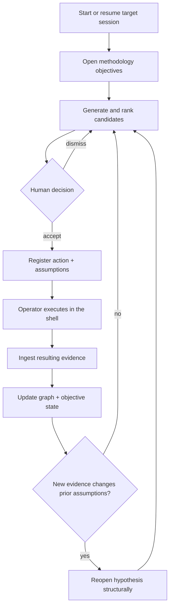
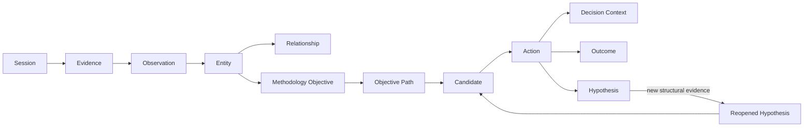

<div align="center">

# EXITONE

**Stateful investigation guidance for security research from the terminal.**

`observe · correlate · suggest — the human decides and executes`


</div>

> [!IMPORTANT]
> ExitOne is intentionally **human-in-the-loop**. It can rank and render command suggestions, but it does not autonomously execute commands against a target. Use it only in environments you own or are explicitly authorized to test.

ExitOne is a terminal-native investigation engine for pentesting, labs, and CTF-style security research. Instead of treating every command as an isolated interaction, it builds a persistent model of what is known, what remains unknown, what has already been tested, and what new evidence changes earlier conclusions.

The core design is **deterministic before generative**: structured outputs are parsed and correlated in Go first; a local LLM is used only where it adds value, such as low-confidence fallback extraction and natural-language queries over already-structured investigation state.

---

## Why ExitOne

Traditional shell workflows lose context between tools. Generic AI assistants have the opposite problem: they can reason conversationally, but often lack a reliable, auditable model of what actually happened in the terminal.

ExitOne sits between those two approaches:

- **Persistent investigation state** — evidence, observations, entities, relationships, objectives, candidates, actions, outcomes, and hypotheses are stored in SQLite.
- **Cross-tool correlation** — methodology triggers operate on entity types and relationships, not on a hard-coded tool name.
- **Explainable suggestions** — candidate commands are ranked with explicit score terms and can be inspected with `exitone why`.
- **Evidence reopening** — a previously closed hypothesis can be reopened when newly discovered structured evidence invalidates the assumptions under which it was tested.
- **Provenance-aware ingestion** — deterministic observations and LLM-assisted observations are kept visibly separate.
- **Hybrid GraphRAG** — `exitone ask` uses narrow LLM classification plus deterministic SQL graph traversal before natural-language generation.
- **Human control** — autocomplete inserts a suggestion into the shell buffer; pressing Enter remains the operator's decision.

---

## Architecture

```mermaid
flowchart LR
    A[Operator / Shell] --> B{Evidence input}
    B -->|Structured output| C[Deterministic parsers]
    B -->|Unknown / unstructured| D[Local LLM fallback]
    C --> E[Evidence + Observations]
    D -->|candidate observations <= 0.5 confidence| E

    E --> F[Investigation Model]
    F --> G[Entities + Relationships]
    G --> H[Methodology Engine]
    H --> I[Objectives + Paths]
    I --> J[Candidate Generator]
    F --> J
    K[Temporal Reasoner] --> J

    J --> L[Strategy Ranker]
    L --> M[Deterministic Command Engine]
    M --> N[CLI / REPL / TUI suggestion]
    N -->|human accepts| O[Action + Decision Context]
    O -->|new evidence / result| P[Outcome + Hypothesis]
    P --> K
    P --> F

    Q[Hybrid GraphRAG] --> R[exitone ask]
    F --> Q
    P --> Q
```



### Investigation lifecycle



---

## Terminal experience

ExitOne provides three interfaces over the same underlying state.

### TUI — recommended workflow

`exitone start <target>` opens a single application with a real PTY-backed terminal on the left and a live investigation sidebar on the right.

```text
┌──────────────────────────────── terminal ────────────────────────────────┬──────── ExitOne ────────┐
│ kali@lab:~$ nmap ...                                                     │ target: 10.10.10.10     │
│                                                                          │ [OVERVIEW]              │
│                                                                          │ ETAPAS                  │
│                                                                          │ surface_discovery ...   │
│                                                                          │                         │
│                                                                          │ SUGERENCIAS             │
│                                                                          │ 0.90 [...] nmap ...     │
│                                                                          │                         │
│                                                                          │ OBJECTIVES ABIERTOS     │
└──────────────────────────────────────────────────────────────────────────┴─────────────────────────┘
  Ctrl+Space: suggestion · F2: view · Ctrl+P: pause · F1: help · Ctrl+Q: exit
```

The sidebar has three views:

| View | Purpose |
| --- | --- |
| **OVERVIEW** | Investigation stages, highest-ranked suggestions, and open objectives |
| **GRAPH** | ASCII attack-surface view built from stored entity relationships |
| **VAULT** | Discovered identities with provenance (`confirmed`, source-provided, or LLM-assisted) |

Keyboard shortcuts:

| Key | Action |
| --- | --- |
| <kbd>Ctrl</kbd>+<kbd>Space</kbd> | Insert the top-ranked command into the prompt — **never executes it** |
| <kbd>F2</kbd> | Cycle `OVERVIEW → GRAPH → VAULT` |
| <kbd>Ctrl</kbd>+<kbd>P</kbd> | Pause/resume sidebar refresh |
| <kbd>F1</kbd> | Contextual help |
| <kbd>Ctrl</kbd>+<kbd>Q</kbd> | Exit the TUI |

### REPL

Running `exitone` with no arguments opens an interactive REPL inspired by `msfconsole`:

```text
┌────────────────────────────────────────────────────────────┐
│                      E X I T O N E                         │
│          exit code 1 — algo requiere investigación        │
└────────────────────────────────────────────────────────────┘
  observa · correlaciona · sugiere — el humano decide y ejecuta

exitone(target) > next
```

### Read-only dashboard

`exitone watch` continuously renders stages, top candidates, and open objectives. `exitone start <target> --tmux` uses the legacy two-pane tmux layout with the operator shell on one side and `exitone watch` on the other.

---

## Requirements

### Required

- **Go 1.27+**
- A Unix-like terminal environment suitable for PTY-based applications

### Optional

- **Zsh** for the provided shell hooks and `Ctrl+Space` ZLE widget
- **tmux** for `exitone start --tmux` and full `pipe-pane` shell-output capture
- A **local OpenAI-compatible chat-completions endpoint** for `exitone ask` and Level 2 fallback extraction

ExitOne defaults to a local LLM endpoint and does not require a hosted AI provider.

---

## Installation

```bash
git clone https://github.com/neavus-23/exitone.git
cd exitone

go build -o exitone ./cmd/exitone
mkdir -p "$HOME/.local/bin"
install -m 0755 exitone "$HOME/.local/bin/exitone"
```

Make sure `~/.local/bin` is in your `PATH`.

Verify the build:

```bash
exitone
```

This opens the REPL. For the full terminal application, start a target session directly:

```bash
exitone start 10.10.10.10
```

Sessions for the same target are resumed by default. Create a clean session explicitly with:

```bash
exitone session new 10.10.10.10 --fresh
```

---

## Optional: Zsh integration

The repository includes shell hooks for event logging, automatic ingestion of explicit output files, tmux stream capture, and a `Ctrl+Space` suggestion widget.

```bash
mkdir -p "$HOME/.exitone"
cp contrib/exitone-hooks.zsh "$HOME/.exitone/exitone-hooks.zsh"
cp contrib/exitone-widget.zsh "$HOME/.exitone/exitone-widget.zsh"

echo 'source "$HOME/.exitone/exitone-hooks.zsh"' >> "$HOME/.zshrc"
source "$HOME/.zshrc"
```

> [!WARNING]
> `contrib/exitone-hooks.zsh` currently assigns its own `PROMPT`. If you already use Starship, Powerlevel10k, Oh My Zsh themes, or another custom prompt, remove or adapt that `PROMPT=...` line before sourcing the hook.

### What the hook captures

| Mode | Behavior |
| --- | --- |
| Command writes an output file (`-o`, `-oG`, `-oX`, `--output`, `>`, etc.) | The file is automatically passed to `exitone ingest` after a successful command |
| Zsh is running inside **tmux** and no output file exists | `tmux pipe-pane` captures the command output and submits the relevant slice in the background |
| Embedded TUI without tmux and no output file exists | There is currently **no `pipe-pane` stream capture**; redirect/save the output or ingest it manually |

This distinction matters: the embedded TUI itself does not currently feed arbitrary PTY stdout into the ingestion engine.

---

## Quick start

### 1. Start an investigation

```bash
exitone start 10.10.10.10
```

ExitOne creates the target host entity, opens the initial discovery objective, and can immediately propose a first discovery action.

### 2. Review the next candidates

```bash
exitone next
```

Example deterministic candidate:

```bash
nmap -sV -sC -p- 10.10.10.10 -oG nmap_full_10_10_10_10.txt
```

Understand why it was ranked:

```bash
exitone why <candidate-id-prefix>
```

### 3. Accept a candidate

```bash
exitone accept <candidate-id-prefix>
```

`accept` records the action and its decision context. It **does not execute the command**.

Execute the command yourself when appropriate, then ingest its output. With the Zsh hook enabled, explicit output files can be picked up automatically.

Manual ingestion is always available:

```bash
exitone ingest ./nmap_full_10_10_10_10.txt
```

To explicitly bind evidence to an accepted action:

```bash
exitone ingest ./result.txt --for-action <action-id-prefix>
```

### 4. Inspect state

```bash
exitone status
exitone stages
```

### 5. Ask about the investigation

With a local LLM endpoint running:

```bash
exitone ask "¿qué falta por investigar?"
exitone ask "¿por qué se reabrió esta hipótesis?"
exitone ask "¿qué relación tiene esta entidad con el host?"
```

`ask` is intentionally separate from `next`: the former explains known state; the latter generates ranked action candidates.

---

## Core commands

| Command | Purpose |
| --- | --- |
| `exitone start <target> [--tmux]` | Start/resume a target and launch the TUI; optionally use the tmux layout |
| `exitone session new <target> [--fresh]` | Create or activate an investigation session |
| `exitone ingest <file> [--tool <hint>] [--host <ip>] [--for-action <id>]` | Ingest tool output |
| `exitone ingest identities <file> --source <source>` | Add one identity per line with provenance |
| `exitone next [--raw]` | Show ranked proposed actions; `--raw` returns only the top command |
| `exitone why <candidate-id>` | Explain the candidate and its score terms |
| `exitone accept <candidate-id>` | Register an action and decision snapshot without executing it |
| `exitone resolve <action-id> --result fail\|success` | Record the result of a modeled hypothesis test |
| `exitone dismiss <candidate-id>` | Dismiss a stale or unwanted candidate |
| `exitone status` | Show entities and methodology objectives |
| `exitone stages` | Show evidence-derived investigation stages |
| `exitone ask "<question>"` | Query structured investigation state through Hybrid GraphRAG |
| `exitone watch [--interval <seconds>]` | Read-only live dashboard |
| `exitone tui` | Launch the TUI for an already-active session |

---

## Evidence ingestion

ExitOne uses a two-level ingestion model.

### Level 1 — deterministic

Deterministic parsing is preferred whenever the shape can be recognized reliably.

| Input | Current handling | Confidence |
| --- | --- | ---: |
| Nmap greppable output | Native deterministic parser | `1.0` |
| `smbclient -L` listings | Native deterministic parser | `1.0` |
| XML with recognizable host/service field aliases | Generic shape-based parser | `1.0` |
| JSON with recognizable host/service/endpoint aliases | Generic shape-based parser | `1.0` |
| Common text tables with host/port/state fields | Generic table parser | `1.0` |
| Web-enumeration lines containing URL + HTTP status | Generic endpoint parser | `1.0` |
| Identity list, one entry per line | Deterministic manual-ingest path | `1.0` |

The generic parsers recognize data by **shape and field aliases**, not by a tool allowlist. Examples include:

- host: `address`, `addr`, `ip`
- port: `port`, `portid`
- protocol: `proto`, `protocol`
- service: `name`, `service`, `servicename`
- state: `state`, `status`
- version/banner: `product`, `version`, `extrainfo`, `banner`
- endpoint: `url`, `input`, `path`
- HTTP status: `status`, `statuscode`, `code`
- response size: `length`, `size`

This lets structurally similar outputs from different scanners feed the same normalized investigation model.

### Level 2 — local LLM fallback

If no deterministic extractor can handle the output, ExitOne can send a bounded slice to the configured local LLM and request explicit candidate observations.

Safety/trust rules are enforced in code:

- LLM observations are stored with `status='candidate'`.
- Confidence is hard-capped at **0.5**, regardless of what the model returns.
- LLM-derived entities are marked `attrs.extracted_by="llm"`.
- Level 2 entities do **not currently trigger methodology or candidate generation automatically**.

The LLM fallback therefore enriches visibility without silently promoting model inference to confirmed evidence.

---

## Investigation model

ExitOne persists a relational investigation graph in SQLite rather than keeping context only in prompts.



Important properties:

- Entities are unique by `(session, type, canonical value)`.
- Re-ingesting the same structured evidence is designed to be idempotent.
- Existing attributes are merged without overwriting useful values with empty data.
- Relationships carry type, confidence, provenance linkage, and validity timestamps.
- Accepted actions preserve a snapshot of what was known when the decision was made.

The database lives at:

```text
~/.exitone/exitone.db
```

SQLite runs with WAL and foreign-key enforcement enabled.

---

## Methodology model

Current methodology triggers are based on discovered entity types and service semantics:

| Trigger | Objective | Paths currently modeled |
| --- | --- | --- |
| Any target host | `initial_discovery` | Port/service discovery |
| SMB-like service | `smb_enumeration` | Anonymous access, authenticated access, alternative source |
| SSH service | `ssh_auth_investigation` | Test known identities |
| HTTP/HTTPS service | `http_enumeration` | Technology, application structure, endpoints, auth surface, identities |
| Domain entity | `domain_identity_enumeration` | Anonymous LDAP, Kerberos user enumeration, authenticated query |

> [!NOTE]
> An objective being modeled does **not** mean every path already has a deterministic command template. ExitOne deliberately keeps unsupported paths visible as known unknowns instead of fabricating a command.

Current deterministic command-generation paths include:

- initial Nmap service discovery,
- anonymous SMB share enumeration,
- SSH authentication checks for known identities,
- read-only `curl -s -i` follow-up for selected interesting endpoints.

---

## Explainable strategy ranking

Candidates are ranked from explicit factors rather than an opaque LLM score.

```text
score = novelty
      × relevance
      × source_confidence
      × max(hypothesis_impact, 0.05)
      × max(objective_impact, 0.05)
      × uncertainty_reduction
      - redundancy_penalty
```

Inspect the actual terms for any candidate:

```bash
exitone why <candidate-id-prefix>
```

This makes the ranking auditable and keeps natural-language generation outside the scoring path.

---

## Temporal reasoning and evidence reopening

Evidence reopening is one of ExitOne's key stateful behaviors.

When an action tests a hypothesis, ExitOne stores the relevant assumptions that were true at that moment. For SSH authentication, for example, it records the complete set of identities known at test time.

Later, if new identities appear, the temporal reasoner computes:

```text
known_at_test_time = identities recorded with the original action
known_now          = identities currently known in the session
gap                = known_now - known_at_test_time
```

A non-empty gap can reopen the previously closed hypothesis and generate a new candidate specifically tied to that structural change.

No LLM text interpretation is used for this comparison.

---

## Investigation stages

`exitone stages` reports discrete, evidence-backed states rather than invented completion percentages:

```text
NOT_STARTED · ACTIVE · PARTIAL · SUFFICIENT · BLOCKED · REOPENED
```

Current stage model:

- `surface_discovery`
- `service_fingerprinting`
- `http_mapping`
- `identity_discovery`
- `authentication`
- `initial_access`

`initial_access` is intentionally reported as `NOT_STARTED` because exploitation/access acquisition is **not yet modeled** in the current methodology engine.

---

## Hybrid GraphRAG for `exitone ask`

ExitOne does not use vector search for the current investigation state. The data is already a small, explicit relational graph, so SQL traversal is more precise and easier to audit.

The query pipeline is:


Current intent categories include pending work, reopening chains, tool/outcome comparison, entity details, and general investigation questions.

The LLM is instructed not to invent missing relationships and not to generate new next actions through `ask`; ranked action generation remains the responsibility of the deterministic strategy pipeline.

---

## Local LLM configuration

ExitOne expects an OpenAI-compatible `/chat/completions` API. Defaults:

| Variable | Default | Purpose |
| --- | --- | --- |
| `EXITONE_LLM_URL` | `http://127.0.0.1:8090/v1` | Local OpenAI-compatible API base URL |
| `EXITONE_LLM_MODEL` | `qwen2.5-3b` | Model identifier sent to the endpoint |
| `EXITONE_DEBUG_LOG` | `~/.exitone/ultra_debug.log` | Override structured debug log path |
| `EXITONE_EVENTS_LOG` | `~/.exitone/events.jsonl` | Zsh hook event log path |

Example:

```bash
export EXITONE_LLM_URL="http://127.0.0.1:8090/v1"
export EXITONE_LLM_MODEL="qwen2.5-3b"
```

> [!CAUTION]
> `ultra_debug.log` is intentionally verbose and can contain commands, candidate explanations, errors, and LLM request/response context. Treat `~/.exitone/` as sensitive investigation data.

---

## Data and observability

Default local files:

```text
~/.exitone/
├── exitone.db                # SQLite investigation state
├── ultra_debug.log           # structured JSONL diagnostic log
├── events.jsonl              # shell-hook command events
├── background_ingest.log     # background hook ingestion output
└── streams/                  # tmux pipe-pane streams when enabled
```

TUI freezes can also be diagnosed with `SIGUSR1`; ExitOne writes a goroutine dump to:

```text
~/.exitone/tui_goroutines.log
```

---

## Testing

Run the Go test suite from the repository root:

```bash
go test ./...
```

The current tests cover, among other things:

- generic XML/JSON/text extraction,
- MAC-address false-positive prevention in host extraction,
- Nmap-like rich greppable records,
- FFUF/Dirb-like endpoint extraction,
- rejection of unrelated free-form output as a structured scan,
- idempotent re-ingestion,
- host creation cascading from discovered services,
- attribute merge behavior.

A manual TUI validation guide is available in [`docs/testing-guide.md`](docs/testing-guide.md).

---

## Current limitations

ExitOne is an active research prototype. The following boundaries are intentional or currently unresolved:

1. **No autonomous exploitation.** The current stage model does not implement initial access/exploitation methodology.
2. **Deterministic command coverage is still narrow.** Several methodology paths can be opened before a corresponding command template exists.
3. **LLM fallback is low-trust by design.** Level 2 observations are capped at `0.5` confidence and do not automatically drive methodology.
4. **Full passive stdout capture currently requires tmux.** The Zsh hook uses `tmux pipe-pane`; the default embedded TUI does not yet stream arbitrary PTY output into ingestion when no output file exists.
5. **Pending-action auto-linking can be ambiguous.** If multiple unresolved actions use the same tool, automatic outcome matching selects the most recent one. Use `--for-action` to disambiguate.
6. **Identity ingestion is currently a normalized list path.** Raw outputs from every identity-enumeration tool do not yet have dedicated deterministic parsers.
7. **Shell hooks are Zsh-oriented.** Other shells can still use the CLI/TUI and manual ingestion, but do not get the provided hook workflow.

These constraints are preferable to silently pretending unsupported behavior is reliable.

---

## Project layout

```text
exitone/
├── cmd/exitone/          # CLI, REPL, dashboard, embedded-terminal TUI
├── contrib/              # Zsh hooks and Ctrl+Space widget
├── db/                   # readable schema reference
├── docs/                 # manual validation documentation
├── internal/
│   ├── commandengine/    # deterministic command rendering + provenance
│   ├── debuglog/         # structured diagnostic logging
│   ├── hypothesis/       # hypothesis/result lifecycle
│   ├── investigation/    # evidence -> entity/relationship model
│   ├── llm/              # local client, fallback extraction, Hybrid GraphRAG
│   ├── methodology/      # entity-driven objectives and paths
│   ├── models/           # domain structs
│   ├── outcome/          # action outcomes + information gain
│   ├── parsers/          # deterministic and generic shape-based extraction
│   ├── stage/            # evidence-derived investigation stage estimator
│   ├── store/            # SQLite store + embedded schema
│   ├── strategy/         # candidate generation and explainable ranking
│   └── temporal/         # structural evidence reopening
├── go.mod
└── go.sum
```

---

## Design principles

- **Deterministic before generative.** If Go/SQL can establish a fact or correlation reliably, the LLM should not be asked to infer it.
- **Evidence is not a conclusion.** Raw evidence, observations, entities, hypotheses, and actions remain separate concepts.
- **Provenance stays attached.** Confirmed, user-provided, and LLM-assisted values should never look equivalent in the UI.
- **State changes matter over time.** A conclusion can become stale when the evidence set changes.
- **Suggestions must be explainable.** Ranking factors and rationale are persisted and inspectable.
- **The human remains the execution boundary.** ExitOne can prepare the command; the operator decides whether it should run.

---

<div align="center">

**ExitOne** — because an exit code is sometimes the beginning of the investigation.

</div>
